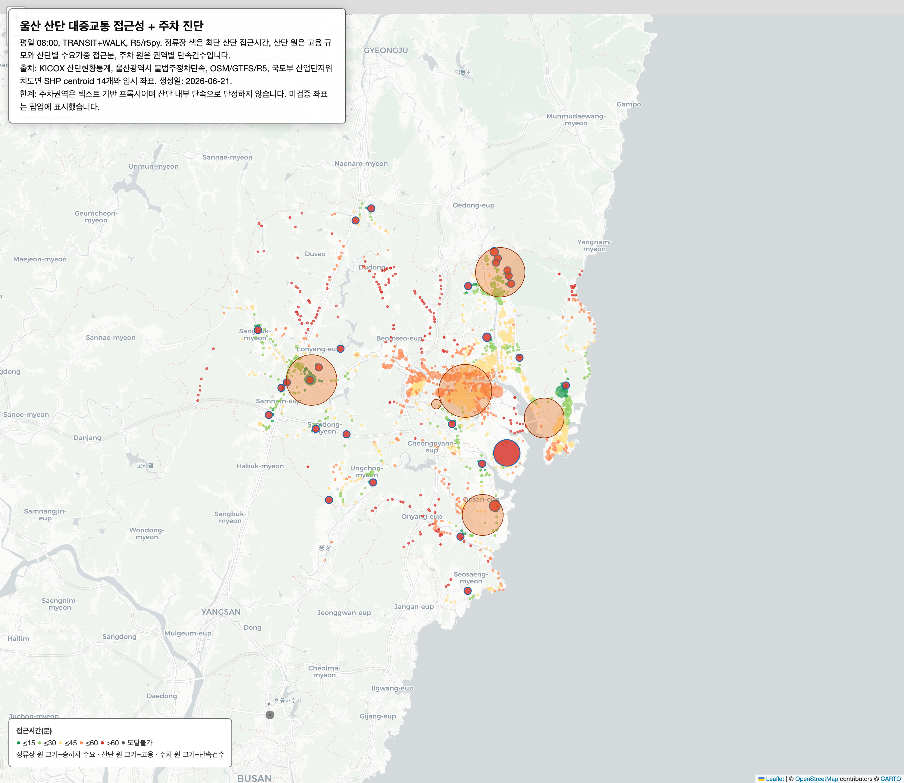
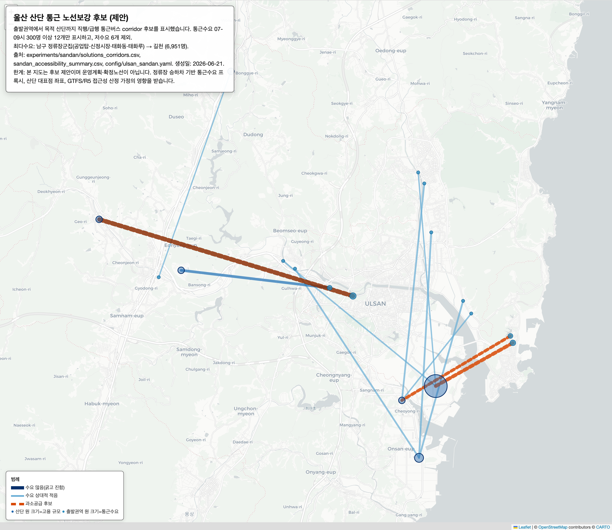

# 울산 산업단지, 대중교통으로 얼마나 닿나 — 통근 접근성 + 주차 공개 진단

> 울산 1인 개발자 담백. 평가하지 않습니다. 공개데이터로 계산한 사실만 둡니다. 판단은 시민의 몫입니다.
> 분석일 2026-06-21 · 라이선스 CC BY 4.0 (원자료는 각 제공기관 조건)

## 한 줄

평일 오전 8시, 울산 어디에서 출발하든 **대중교통으로 산업단지에 닿기 어렵습니다.** 주요 산단 29곳 모두 도시 전역 평균 접근시간이 **60분을 넘고, 45분 안에 닿는 곳은 0곳**입니다.

## 공개데이터로 볼 수 있는 것은 여기까지입니다 — 더 나아가려면

우리가 가진 자료는 전부 공개데이터입니다 — 정류장별 카드 승하차, 산단 고용, 주차단속. 이걸로 **"어느 산단이 대중교통으로 닿기 어려운가"까지는 보입니다.**

그러나 **"누가, 어디서, 그 산단으로 통근하는가"는 공개데이터에 없습니다.** 카드로 *어느 정류장에서 몇 명이 타는지*는 알아도(실측), 그 사람들의 *목적지*는 집계에 없습니다. 그래서 "이 동네 사람들이 그 산단으로 간다"는 것은 확인된 사실이 아니라 출근시간대 승차량으로 미루어 본 추정입니다. 또한 접근시간은 개인의 통근시간이 아니라 도시 전역의 연결성 지표(상대 순위가 메시지)입니다.

**여기서 더 정밀하게 — 실제 통근 노선을 설계하는 단계로 — 나아가려면 산단·근로자 단위의 통행(OD) 자료나 통근버스 운행 실데이터가 필요하며, 이는 시·공단 등 관공서의 협조가 있어야 얻을 수 있습니다.** 이 자료는 그 협조를 요청하기 위한 근거이자 출발점입니다.

## 핵심 수치

| 지표 | 값 |
|---|---|
| 분석 대상 산단 | 29곳 (고용 확인 13.4만 명, KICOX) |
| 도시 수요가중 평균 접근시간 | **91.6분** |
| 45분 이내 도달 산단 | **0 / 29** |
| 60분 이내 도달 산단 | **0 / 29** |
| 정류장에서 가장 가까운 산단까지 평균 | 38.9분 |

### 고용가중 사각지대 상위 (접근 나쁨 × 고용 큼)

| 산단 | 고용(명) | 평균 접근 | 인접권역 주차단속 |
|---|---:|---:|---:|
| 울산·미포 | 98,008 | 86.4분 | 11,740건 |
| 온산 | 15,498 | 90.1분 | 12,289건 |
| 신(자유무역지역 포함) | 3,416 | 83.8분 | 12,289건 |

> 울산 최대 고용처 미포(9.8만 명)조차 도시 평균 86분. 접근이 나쁜 산단일수록 인접 권역 불법주정차 단속도 많은 경향이 함께 보입니다. (다만 위 ⚠️대로, 이 둘의 인과를 단정하지 않습니다.)

## 방법

- 도착지: 울산 주요 산단 29곳 (KICOX 산단현황통계의 고용·가동업체 + 좌표).
- 출발지: 울산 정류장별 승하차 수요 (대중교통 이용 수요 프록시).
- 접근성: R5(r5py), 도보+대중교통, 평일 08:00 출발. GTFS·도로망(OSM) 기반.
- 고용가중 사각점수 = 고용 × max(접근분 − 45, 0).
- 주차: 울산 불법주정차단속 위치 텍스트를 산단·인접 권역으로 묶은 프록시.

## 데이터 출처 (전부 공개)

- KICOX 산단현황통계(국가/일반/도시첨단) — data.go.kr 15085874·15085886·15085880, 기준 2025.
- 울산광역시 불법주정차단속 — data.go.kr 15091256, 기준 2025-12-31.
- 산단 좌표 — 국토교통부 산업단지위치도면 SHP centroid(data.go.kr 15081111)로 14곳 검증, OSM 교차확인.
- 도로망 OSM(Geofabrik) · 버스 GTFS(자체 가공본, 평일 20260601–20261231).

## 한계 (정직하게)

- **목적지 미상**: 카드 데이터에 통근 목적지가 없어, "이 출발지 사람들이 그 산단으로 간다"는 가정이다. 산단·근로자 OD는 비공개다. (위 ⚠️ 참조 — 이 분석의 가장 큰 한계)
- **연결성 ≠ 통근시간**: 수치는 도시 전역 가중평균 연결성이며 개인 통근시간이 아니다. 상대 순위가 메시지다.
- **좌표**: 14곳만 국토부 SHP로 검증, 나머지 15곳(대부분 고용 0·소형)은 임시·미검증이다. 미포·온산처럼 면적 큰 산단의 중심점은 실제 입주지와 수 km 차이날 수 있다.
- **주차**: 위치 텍스트 기반 권역 프록시이며 산단 내부 단속건수가 아니다. 전체 13.2만 건 중 46.6%만 권역 매핑.
- **모델 가정**: 배차·환승·도보연결은 GTFS·모델 가정에 영향을 받는다. 산단 교대시간은 반영하지 못했다.

## 처방 — 노선보강 후보

진단에서 멈추지 않고, 우선순위 산단과 통근버스 노선 후보까지 정리했습니다. 상세는 [SOLUTIONS.md](SOLUTIONS.md) 참조.

## 무엇을 위한 자료인가

산단 통근의 대중교통 공백이 **대략 어디에, 얼마나** 큰지 한 장으로 봅니다. "어느 산단부터 노선·배차를 살펴볼지"의 출발점이지 결론이 아닙니다. 데이터·코드 전부 공개하니 누구나 재현·반박할 수 있고, 한계를 메우려면 어떤 데이터가 더 필요한지도 분명히 적었습니다.
